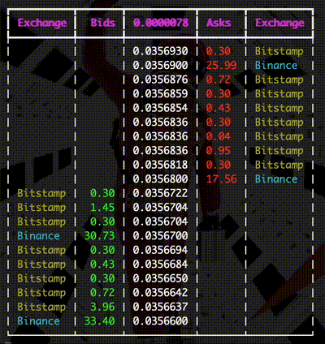

# **Orderbooks Aggregator**

Combines orderbooks from multiple exchanges:

---

## **Design**

Having a background in writing C++ applications built around the single-threaded reactor design pattern, I transitioned my coding approach to embrace idiomatic asynchronous Rust, leveraging the `tokio` runtime.

The architecture consists of:

1. **Streams-based `OrderbookProcessor`**: Combines `ExchangeWebsocket` streams from different exchanges to update a unified `CombinedOrderbook`.
2. **gRPC `OrderbookService`**: Subscribes to the `OrderbookProcessor` and forwards the aggregated book to external subscribers.

---

## **Design Principles**

- Modular, extensible design.
- Clear ownership and separation of concerns.
- Preference for clean, readable code over verbose documentation.
- Focus on minimizing latency.
- Unit tests for critical logic.

---

## **Test Client**

A Python test client, along with usage instructions, can be found in the [proto](./proto) folder.

---

## **Potential Improvements**
- Deserialise only up to the first `max_orders` bids/asks per book update.
- There's potential to leverage more generic code between different exchange implementations of the `Orderbook` stream.
